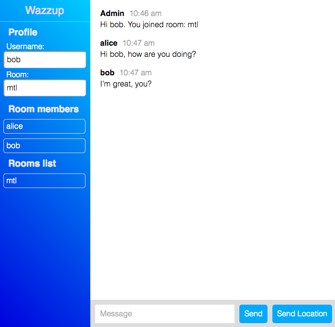

## Instant Real time chat service

**DEMO** : https://whispering-eyrie-36503.herokuapp.com

Screenshot



### Tech stack

* [Node.js](https://nodejs.org/en/)
* [Socket.io](http://socket.io/)
* [Moment.js](http://momentjs.com/)

### How to run

```
npm run start
```

Build image, push it to DockerHub, and run it

```sh
docker build -t yuichihagio/wazzup .
docker push yuichihagio/wazzup
docker run -d -p 3000:3000 <container-id> # or yuichihagio/wazzup:latest
docker ps # Check if it is running
docker stop <container-id> # Stop the container
```

### Deploy Docker

```
./deploy.sh
```